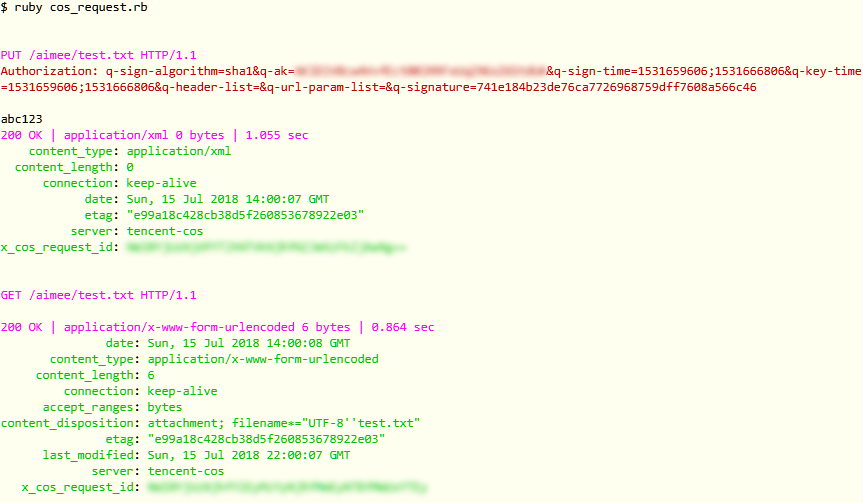

# cos_request

验证腾讯云的对象存储服务的文件上传和下载API

## 用法

* 使用自己的cos配置

```ruby
# TODO: 注意改成自己的配置，下面的配置并不是真实的
Conf = OpenStruct.new \
    appid:      '1244057171',
    secret_id:  'tvUS9R0llq6U2IDfV4ER6tA8KsFd0ZxcVAcw',
    secret_key: 'MT1Yjc1a4ymrg6hq2TtOFf96tGl0a38U',
    host:       'def-1244057171.cos.ap-chongqing.myqcloud.com'
```

* 命令行测试

```shell
ruby cos_request.rb
```

* 或者使用自己的代码测试，例如

```ruby
CosRequest.put '/aimee/test.txt', body: 'abc123'
CosRequest.get '/aimee/test.txt'
```

## 输出示例


